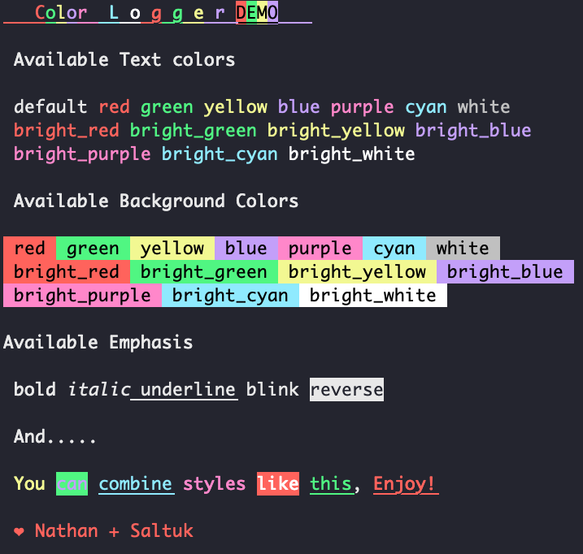

# Color Logger

*Make terminal output pretty*

## Install

Grab a copy

	> curl -O https://raw.githubusercontent.com/nathanstilwell/color-logger/0.1.0/lib/color_logger.sh

And drop it in where you need

	# import color logger
	. color_logger.sh

## Requirements

*(one of these, see note below)*

+ bash version 4.0+
+ zsh
+ ksh version ksh93t+

## usage:

    log [message] [-biuln] [-c color] [-k background-color]

    options

      -b        text is bold

      -i        text is italic

      -u        text is underlined

      -l        text blinks

      -r		reverse formatting

      -n        do NOT add new line ("\n") after message

      -c  color
            format text with specified named color. See below for available colors.

      -k  background-color
            format text with background-color of specified name. See below for available colors.

## Available Colors

## Examples

    # import color logger
      . color_logger.sh

	# log a message in the default text color with default formatting
	log "message"

	# log a message in bold
	log "message" -b

	# log a message in red
	log "message" -c "red"

	# log a message in blue with a white background
	log "message" -c "blue" -k "white"

	# log a message in blue in bold and underlined
	log "message" -c "blue" -bu

Logging diffent formatting inline with `-n`

	log "usage: " -bn;
	log "log" -un;
	log " [-biulrn] [-c color] [-k background]"

would log

## Notes

This script uses associative arrays which are **not** a feature in bash 3.x, which is the version of bash on OS X systems. In short, if you are running scripts on a mac you are going to have to zsh or ksh. Color logger has a zsh shebang.
